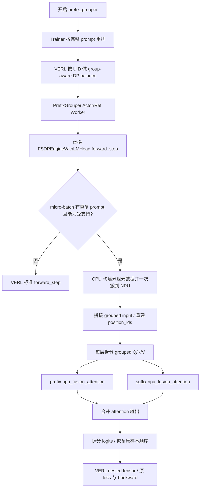

# NPU 侧共享前缀实现技术汇报

> 汇报基线：`parallel` 分支，提交 `6118794`（2026-09-03）  
> 目标软件栈：CANN 9.0.0、PyTorch/torch-npu 2.10.0、vLLM 0.22.1、vllm-ascend 0.22.1rc1、VERL 0.9.0、PrefixGrouper 0.0.1.post1  
> 说明：本文区分“当前训练主链路”和“独立 AscendC 算子原型”。性能结论必须以同条件 Atlas A2/Ascend 910B 实测为准。

## 1. 汇报摘要

当前方案已在 Agent Lightning + VERL 的文本 GRPO 训练链路中打通共享前缀：同一 micro-batch 内，具有完全相同 prompt 的多条 response 只保留一份 prompt，模型每层仅计算一次 prefix hidden state 和 prefix self-attention；各 response 仍独立计算 suffix，并通过位置编码和 causal mask 保持与普通 decoder 序列相同的可见性。

NPU 当前生效路径不是自研 AscendC attention，而是调用 torch-npu 2.10.0 的 `npu_fusion_attention`：

- 输入布局使用 BNSD；
- prefix attention 与 suffix attention 每层各调用一次融合注意力；
- GQA/MQA 的 K/V head 先扩展到 query head 数；
- 使用完整的 `[B, 1, Q, K]` 布尔 causal mask，调用前完成 mask 语义取反；
- grouped Q/K/V 的拆分已经切换为线性索引，并在 NPU 上用 `npu_scatter_nd_update_` 完成行写入。

当前实现已经覆盖 old-policy log-prob、reference-policy log-prob 和 actor update 的前向/反向，不覆盖 vLLM rollout、critic、reward model 与多模态 batch。功能默认关闭，只有开启配置后才替换 actor/reference worker。

从源码完整度看，当前状态可概括为：**主流程已接通、算法语义已具备 CPU 对照测试、NPU 接口契约已固化，但尚缺固定栈真机上的端到端正确性与性能闭环。** 仓库内虽已提供紧凑 TND AscendC 前后向算子原型，但它仍是独立包，未被 Agent Lightning 主链路导入。

## 2. 背景与目标

GRPO 通常为同一个 prompt 采样 `G` 条 response。若 prompt 长度为 `P`、每条 response 长度为 `S`，普通训练会构造 `G` 条完整 decoder 序列：

```text
[P, R1]
[P, R2]
...
[P, RG]
```

其中 prompt 被重复计算 `G` 次。共享前缀将物理输入改为：

```text
[P, R1, R2, ..., RG]
```

但逻辑上仍保持 `G` 条彼此隔离的序列。其设计目标是：

1. 相同 prompt 的 embedding、RMSNorm、MLP 和 attention prefix 部分只计算一次；
2. 每条 response 只能看到共享 prompt 与自身历史，不能看到其他 response；
3. 每条 response 的 RoPE position ID 从自身对应的 `P` 重新开始；
4. response loss 对共享 prefix 的梯度能够正确求和；
5. 输出恢复为 VERL 原有格式，使 PPO/GRPO 的 reward、advantage、KL 和 loss 公式保持不变。

对等长 response，模型处理的有效 token 数从

```text
baseline = G × (P + S)
grouped  = P + G × S
```

减少为只保留一份 prefix；理论上节省 `(G - 1) × P` 个重复 token。causal attention pair 的理论减少量为：

```text
(G - 1) × P × (P + 1) / 2
```

这是算法工作量变化，不等于实际加速比。实际收益还受 padding、分组命中率、micro-batch 边界、NPU mask/KV 物化、FSDP 通信和算子启动开销影响。

## 3. 当前生效架构



### 3.1 配置与 Worker 路由

总开关位于 `agent-lightning/agentlightning/verl/config.yaml`，默认 `enabled: false`。开关同时映射到 VERL 的 `actor.use_prefix_grouper`，用于在 data-parallel balance 时保持 rollout group 不被拆到不同 rank。

入口 `agent-lightning/agentlightning/verl/entrypoint.py` 在功能开启时，将原生 `ActorRolloutRefWorker` 替换为 `PrefixGrouperActorRolloutRefWorker`。该 worker 的 actor 和 reference 子 worker 都使用 `PrefixGrouperTrainingWorker`，因此优化范围包括：

- actor 计算 old-policy log-prob；
- reference policy log-prob；
- actor update 的前向和反向。

异步 vLLM/vllm-ascend rollout server 不经过这条模型训练前向路径，因此 rollout 生成不共享前缀。

### 3.2 Batch 保组

`reorder_by_prompt()` 使用去除 padding 后的完整 prompt token tuple 作为 key，只合并 token 完全一致的 prompt。各组按组大小降序排列，以提高大组在后续切分中保持完整的概率。

Trainer 在两个位置执行重排：

1. rollout 汇总后、old/reference log-prob 计算前；
2. 过滤过长样本后、PPO mini-batch 裁剪前。

该设计同时依赖 VERL 的 UID 保组与 Agent Lightning 的 token 精确匹配。若 local micro-batch size 不能容纳完整 rollout group，即使全局 batch 中存在重复 prompt，也只能在各 micro-batch 内局部共享。

### 3.3 Grouped input 与位置编码

每个 prompt 组选择第一行作为 prefix representative，并把组内全部 response 连续排列：

```text
原始： [P1,R11] [P2,R21] [P1,R12] [P2,R22]
重排： [P1,R11] [P1,R12] [P2,R21] [P2,R22]
物理： [P1,R11,R12] [P2,R21,R22]
```

`PrefixGrouper.from_ungrouped_masks()` 根据 prefix/suffix 有效长度生成 padding mask、prefix/suffix mask、group/ungroup 索引和目标 shape。当前集成先在 CPU 完成这些包含 `.item()` 的数据相关预计算，再将缓存 tensor 去重后一次搬到 NPU，避免每层重复触发设备标量读取。

每条 response 的 position ID 都从对应 prefix 长度重新开始。例如 `P=3` 时，两条 response 的位置均为：

```text
prefix: 0, 1, 2
R1:     3, 4, ...
R2:     3, 4, ...
```

因此 response 在物理布局中的先后顺序不会改变 RoPE 语义。

## 4. NPU Attention 实现

### 4.1 每层计算过程

模型 attention 投影产生 grouped BNSD Q/K/V 后，`PrefixGrouper.forward()` 执行：

```text
grouped Q/K/V
  ├─ ungroup -> prefix Qp/Kp/Vp
  └─ ungroup -> suffix Qs/Ks/Vs

prefix attention:
  Attention(Qp, Kp, Vp)

suffix attention:
  Attention(Qs, repeat(Kp)+Ks, repeat(Vp)+Vs)

prefix/suffix output -> group -> 下一 Transformer 层
```

prefix attention 使用普通左上 causal 语义；suffix attention 的每一行都能看到完整 prefix 和自身不晚于当前 query 的 suffix token。不同 response 之间没有可见边。

### 4.2 BNSD 融合注意力调用

当前 NPU operator boundary 位于 `agent-lightning/agentlightning/verl/prefix_grouper.py::_npu_bnsd_attention()`，调用参数核心为：

```python
torch_npu.npu_fusion_attention(
    query=query,
    key=key,
    value=value,
    head_num=query.shape[1],
    input_layout="BNSD",
    atten_mask=~causal_mask,
    scale=scale,
    keep_prob=1.0 - dropout,
    sparse_mode=0,
)
```

关键适配点如下：

| 适配项 | 当前实现 |
|---|---|
| Q/K/V 布局 | `[B, N, S, D]`，即 BNSD |
| 输出布局 | NPU 输出 BNSD，转置为 Transformers 使用的 BSND |
| Mask | 每次构造 `[B, 1, Q, K]` 完整布尔 mask |
| Mask 语义 | PyTorch `True=允许`；NPU `True=屏蔽`，仅在算子边界取反 |
| Causal 模式 | `sparse_mode=0`，由完整 mask 表达 prefix/suffix 可见性 |
| GQA/MQA | K/V 使用 `repeat_interleave` 扩展至 query head 数 |
| Dropout | `keep_prob = 1 - dropout` |
| Scale | 优先使用模型传入值，否则为 `head_dim**-0.5` |

代码强制 torch-npu public version 为 2.10.0，并检查 Q/K/V rank、batch、head、head size 和 mask shape。该约束与目标 NPU 依赖矩阵一致。

### 4.3 NPU 友好的拆分与索引

原始 `UngroupFunction` 使用二维高级索引 `[batch, sequence]` 拆分 Q/K/V。当前版本增加了线性路径：

1. 将 BHSD 转为连续 BSHD；
2. 展平 `(batch, sequence)` 为单轴 token row；
3. 用缓存好的线性索引执行 `index_select`；
4. 用 `npu_scatter_nd_update_` 将有效 row 写入 prefix/suffix 输出；
5. reshape 并转回 BHSD。

线性索引在 `GroupInfo.precompute()` 中一次生成；NPU 使用 int32 索引，CUDA 使用 int64。自定义 autograd backward 反向执行对应的 gather/scatter，把 prefix 和 suffix 梯度写回原 grouped tensor。

该优化解决的是 NPU 对高级索引展开和 axis-0 scatter 接口不友好的问题。它减少了逐层重复索引计算，但仍包含 `permute().contiguous()`、中间零张量和 scatter 操作，其真实耗时需要 NPU profiler 量化。

### 4.4 避免设备动态 shape 推断

集成覆盖了 `PrefixGrouper.batch_repeat_cat()`，为 `torch.repeat_interleave()` 显式提供：

```python
output_size=suffix.shape[0]
```

这样无需 NPU 从 `num_samples` tensor 动态推断输出长度。该函数用于为每条 suffix 复制相应 prefix K/V，以及在输出对齐时复制 prefix 最后一个 logits。

## 5. 输出、Loss 与反向传播

模型产生 grouped logits 后，VERL 的 `pg_forward()` 调用：

```text
split_output(logits, include_prefix_last=1)
```

自回归模型中，response 第一个 token 由 prefix 最后一个位置的 logits 预测，因此该位置会复制到同组每条 suffix 的开头。之后对齐 completion token，计算 log-prob 和可选 entropy，再通过 `inverse_order` 恢复原始 batch 顺序，最终转换为 VERL 期望的 jagged nested tensor。

反向传播由三部分共同完成：

1. `npu_fusion_attention` 提供 attention backward；
2. PrefixGrouper 的 Group/Ungroup 自定义 autograd 恢复 grouped 梯度；
3. `repeat_interleave` 对共享 prefix K/V 的多条 response 梯度自动求和。

因此对同一 prompt 的 `G` 条 response，理论梯度关系为：

```text
dL/dP = Σ(i=1..G) dL_Ri/dP
```

当前仓库的 Tiny Qwen2 对照测试用确定性、dropout=0 的 CPU SDPA 路径比较 baseline 与 grouped 路径的 log-prob、entropy 和全部参数梯度；这能验证算法与集成契约，但不能替代 NPU 融合算子的硬件数值验证。

## 6. 能力边界与回退策略

### 6.1 启动时硬约束

- 仅支持 language-model worker；
- VERL 运行时接受 0.9.x，项目固定部署版本为 0.9.0；
- actor strategy 必须为 FSDP 或 FSDP2；
- `use_remove_padding=false`；
- VERL fused kernels 必须关闭；
- `ulysses_sequence_parallel_size=1`；
- torch-npu 必须为 2.10.0。

### 6.2 Micro-batch 自动回退

以下情况调用 VERL 标准 `forward_step`：

- 当前 micro-batch 没有重复 prompt；
- 包含多模态输入；
- 动态启用 remove-padding 或 fused kernels；
- 启用 distillation top-k；
- 启用 `calculate_sum_pi_squared`。

这种回退保证功能兼容性，但也意味着同一训练任务内可能同时出现 grouped 与 baseline micro-batch，收益取决于真实分组命中率。

### 6.3 当前不覆盖

- vLLM/vllm-ascend rollout 生成；
- critic 与 reward-model worker；
- 跨 micro-batch、跨 DP rank 的 prefix 复用；
- 部分相同 prompt、前缀树或 response 公共片段复用；
- Ulysses sequence parallel；
- 多模态输入。

## 7. 当前实现的主要收益与代价

| 维度 | 收益 | 当前代价 |
|---|---|---|
| 模型 token | prefix 的 embedding/MLP/Norm 等只处理一次 | grouped 行可能因 suffix 总长度产生 padding |
| Attention | prefix self-attention 只计算一次 | 每层拆成 prefix/suffix 两次算子调用 |
| 激活 | 不再为每条 response 保存独立 prefix 主干激活 | suffix attention 前仍物化重复 prefix K/V |
| GQA/MQA | 语义兼容 | K/V head 扩展会增加中间张量与带宽 |
| Mask | 能精确表达 response 隔离 | 完整四维 mask 的显存和构造开销随 `Q×K` 增长 |
| 框架接入 | 保持 VERL loss/FSDP 契约 | monkey patch 与 VERL/Transformers attention 接口强耦合 |
| 分布式 | UID 保组减少跨 rank 拆分 | group 数、DP size、mini/micro-batch shape 需协同配置 |

由此可见，当前 BNSD 路径首先验证“共享前缀在 NPU 训练栈中可接通”，但还没有完全释放紧凑共享 KV 的硬件潜力。主要剩余冗余来自 suffix attention 的 prefix K/V 复制、GQA head 扩展和完整 mask 物化。

## 8. 独立 AscendC 紧凑算子原型

仓库 `PrefixGrouper/npu_ops` 还提供 `prefix-grouper-npu==0.1.0` 原型。该包与当前 Agent Lightning 主链路相互独立；仓库其他生产代码没有导入 `prefix_grouper_npu` 或调用 `shared_prefix_attention`。

### 8.1 设计

原型直接接收紧凑 TND 张量：

```text
Q: [T, Hq, 128]
K/V: [T, Hkv, 128]
```

每组物理存储一份 prefix 和多份 suffix，并为每个 token 提供三组 int32 元数据：

- `prefix_start`：所属共享 prefix 起点；
- `prefix_end`：所属共享 prefix 终点；
- `sequence_start`：当前 token 所属 prefix 或 suffix 的起点。

prefix query 只遍历自身之前的 prefix key；suffix query 遍历完整 prefix 和自身 causal suffix，不复制 prefix K/V，也不物化四维 mask。

前向使用 FP32 online softmax 累加并保存 LSE；反向显式计算 dQ/dK/dV。dK/dV 以 compact key token 为任务，遍历所有允许关注它的 query，因此同一 prefix K/V 的多条 response 梯度直接累计到唯一存储位置。

### 8.2 当前限制

- 仅 Atlas A2/Ascend 910B；
- 仅连续 BF16；
- 仅 `head_dim=128`；
- 不支持 dropout；
- 无 CPU fallback；
- 未声明确定性保证；
- 不负责分布式通信；
- 当前 kernel 为 AIV-only、按 query-token/head 标量式遍历 key，tiling block 数上限为 20。

最后一点表明它更接近功能原型：从源码推断，当前实现没有使用 Cube 矩阵计算或 FlashAttention 式分块流水，长序列下可能受全局内存访问和串行 key 遍历限制。这是代码结构推断，不是性能实测结论。

### 8.3 主链路与原型对比

| 项目 | 当前主链路 BNSD | AscendC 原型 TND |
|---|---|---|
| 是否接入训练 | 是 | 否 |
| Attention 实现 | torch-npu 融合算子 | 自定义前后向 kernel |
| Prefix K/V | suffix 前按 response 复制 | 紧凑存一份 |
| GQA | 扩展 K/V head | kernel 内映射 Q head 到 KV head |
| Mask | 完整 `[B,1,Q,K]` | 三个 `[T]` 范围元数据 |
| Dtype/head dim | 由融合算子与模型路径约束 | 仅 BF16 / 128 |
| Dropout | 支持传递 keep probability | 不支持 |
| 验证成熟度 | 有框架契约测试，缺 NPU 实机闭环 | 有 Meta/计划测试与真机测试脚本，缺仓库内真机结果 |

## 9. 验证现状与证据边界

### 9.1 已存在的验证资产

主链路已有测试覆盖：

- actor/reference worker 路由；
- prompt 分组忽略 padding；
- Tiny Qwen2 baseline/grouped 的 log-prob、entropy 和梯度对齐；
- NPU BNSD 参数、完整 mask、dropout/scale 传递；
- 非 torch-npu 2.10.0 拒绝逻辑。

AscendC 原型已有：

- plan 元数据与缓存测试；
- PyTorch schema 和 Meta shape inference 测试；
- 8 组 Ascend 910B 前向/反向对照用例；
- 对物化 FP32 reference 的验收阈值：cosine ≥ 0.999，输出 max-abs ≤ 0.05，梯度 max-abs ≤ 0.1；
- 与物化 TND `npu_fusion_attention` 比较延迟、峰值显存并采集 profiler 的脚本。

### 9.2 本次可确认与不可确认

本次报告完成了源码、配置、版本声明、测试定义和调用关系的静态核对。当前主机的 `agent` 环境是 GPU 栈：VERL 0.9.0、vLLM 0.22.1+cu129、PyTorch 2.11.0+cu129、PrefixGrouper 0.0.1.post1，未安装 torch-npu 与 vllm-ascend。因此本次没有执行 NPU 运行时、NPU 测试或 benchmark。

在当前仓库结果目录中未发现可用于引用的固定栈 Atlas A2/Ascend 910B 原始正确性或性能结果。由此：

- 可以确认代码当前采用 BNSD 主链路及其接口、数据流和回退条件；
- 可以确认项目已经准备 NPU 真机测试与 benchmark 入口；
- 不能据此确认 NPU 硬件数值正确性、稳定性、显存收益、吞吐提升或端到端加速比；
- GPU 侧已有数据不能替代 NPU 结论。

## 10. 风险与问题清单

### P0：缺少真机闭环

当前最关键缺口是目标固定栈上的真实 NPU 证据。至少需要分别验证主链路 BNSD 与 AscendC 原型的前向、反向、端到端训练和资源指标，否则无法给出上线或收益结论。

### P1：BNSD 路径仍有三类物化开销

1. suffix attention 为每条 response 复制共享 prefix K/V；
2. GQA/MQA 将 K/V head 扩展到 query head 数；
3. 每层构造完整 `[B,1,Q,K]` mask。

长 prompt、大 group size 场景中，这三项可能抵消部分共享 prefix 的显存和带宽收益，需要通过 NPU profiler 分阶段定量。

### P1：数据保组影响命中率

共享只发生在单个 micro-batch 内。UID、DP balance、group size、local batch、PPO mini-batch 与 micro-batch 任一环节不匹配，都会把完整组切碎。报告性能时应同时记录“理论组大小”和“实际每个 micro-batch 的分组命中率”。

### P1：文档与代码存在历史口径差异

`agent-lightning/docs/algorithm-zoo/verl.md` 仍描述 NPU 使用 packed TND、压缩 causal mask 和原生 GQA；当前生产代码已经改为 BNSD、完整四维 mask、KV head 扩展。对外汇报和部署手册应以本报告与当前代码为准，并同步修正文档。

### P2：版本声明宽严不一

Agent Lightning 的 optional dependency 对 VERL 声明较宽，但运行时只接受 0.9.x；项目 NPU 目标则固定 VERL 0.9.0。部署应使用固定 requirements 与版本检查，不能只依赖 optional extra。

### P2：非零 attention dropout 仍需单独验证

当前 CPU 数值对照使用 dropout=0。grouped 路径改变了算子调用次数和张量布局；当 attention dropout 非零时，固定 seed 下不应默认期待与 baseline 逐元素一致，需要定义统计或训练收敛层面的验收方法。

## 11. 建议推进路线

### 第一阶段：完成当前 BNSD 主链路真机验收

1. 在 Atlas A2/910B 上固定 CANN 9.0.0、torch-npu 2.10.0、vLLM 0.22.1、vllm-ascend 0.22.1rc1、VERL 0.9.0；
2. 先跑最小前向/反向正确性，再跑单步 FSDP 集成，最后跑已注册的端到端 workload；
3. baseline 必须使用同一 Agent Lightning revision，且完全不启用 PrefixGrouper；
4. 记录 log-prob、entropy、梯度、loss、峰值显存、阶段耗时、吞吐、功耗、实际分组命中率；
5. 用 profiler 拆分 ungroup、mask 构造、KV repeat/cat、两次 fusion attention、group、FSDP 通信占比。

### 第二阶段：消除框架路径主要物化开销

按风险和收益依次评估：

1. 将完整 BNSD mask 改为 NPU 支持的紧凑 causal 表达；
2. 保留原生 GQA，避免 KV head 扩展；
3. 避免 suffix attention 物化重复 prefix K/V；
4. 继续减少 group/split_output 的高级索引与中间零张量；
5. 缓存可复用的 mask/索引，但缓存 key 必须覆盖真实 shape、device 与布局。

### 第三阶段：决定 AscendC 原型去留

先完成原型真机正确性与 profiler，再与 BNSD 主链路在等价输入下比较。若原型不能显著改善核心瓶颈，应优先优化成熟融合算子路径；若紧凑 KV 与无四维 mask 显示明确收益，再推进：

- 分块 softmax 与 Cube 矩阵化；
- 双缓冲和访存流水；
- 更完整的 dtype/head-dim/dropout 支持；
- 与 Transformers/VERL attention wrapper 的正式集成；
- FSDP 端到端梯度、稳定性和长序列压力验证。

## 12. 结论

NPU 侧共享前缀当前已经具备完整的框架级闭环：从 batch 保组、FSDP worker 路由、grouped input、位置编码、分段 attention，到输出恢复和梯度回传，主链路逻辑是连通的。现阶段实际依赖 torch-npu BNSD 融合注意力，工程兼容性优先，但仍保留 prefix K/V 复制、GQA head 扩展和完整 mask 等显著物化成本。

独立 AscendC 原型从数据结构上更接近理想的紧凑共享前缀 attention，但尚未接入训练，而且内核实现仍处于功能原型阶段。下一步工作的优先级不应是先给出加速数字，而应是先在固定栈真机上完成正确性与阶段级 profile，再用数据决定继续优化 BNSD 路径，还是投入 AscendC 融合算子。

## 附录：主要代码证据

| 内容 | 文件 |
|---|---|
| 总开关与 VERL 保组配置 | `agent-lightning/agentlightning/verl/config.yaml:18-19,33` |
| Worker 路由 | `agent-lightning/agentlightning/verl/entrypoint.py:188-197` |
| 两次 batch 重排 | `agent-lightning/agentlightning/verl/trainer.py:264-268,379-386` |
| BNSD attention 与 NPU 适配 | `agent-lightning/agentlightning/verl/prefix_grouper.py:49-238` |
| Grouped forward 与 FSDP hook | `agent-lightning/agentlightning/verl/prefix_grouper.py:306-509` |
| Group/Ungroup 与 NPU scatter | `PrefixGrouper/src/prefix_grouper/function.py:13-220` |
| 分组 mask 与线性索引预计算 | `PrefixGrouper/src/prefix_grouper/info.py:71-170` |
| PrefixGrouper attention 分解 | `PrefixGrouper/src/prefix_grouper/forward.py:39-80` |
| 主链路集成测试 | `agent-lightning/tests/verl/test_prefix_grouper_verl090.py:120-243` |
| 固定 NPU Python 栈 | `agent-lightning/scripts/requirements_prefix_grouper_npu.txt:1-18` |
| AscendC 原型 Python API | `PrefixGrouper/npu_ops/prefix_grouper_npu/attention.py:35-180` |
| AscendC 前向 kernel | `PrefixGrouper/npu_ops/opp/project/op_kernel/shared_prefix_attention_forward.cpp:11-200` |
| AscendC 反向 kernel | `PrefixGrouper/npu_ops/opp/project/op_kernel/shared_prefix_attention_backward.cpp:11-251` |
| 原型真机验证入口 | `PrefixGrouper/npu_ops/scripts/run_910b_validation.sh:1-37` |
