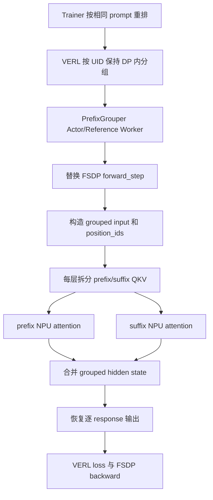

# NPU 侧共享前缀接入方案设计

> 代码基线：`parallel` 分支，提交 `6118794`（2026-09-03）
>
> 软件栈：CANN 9.0.0、torch-npu 2.10.0、vLLM 0.22.1、vllm-ascend 0.22.1rc1、VERL 0.9.0、PrefixGrouper 0.0.1.post1

## 1. 核心设计

当前方案在 Agent Lightning + VERL 的 Actor/Reference FSDP 前向中接入 PrefixGrouper。同一 prompt 的多条 response 从：

```text
[P, R1] [P, R2] [P, R3] [P, R4]
```

重组为：

```text
[P, R1, R2, R3, R4]
```

模型层间只保留一份 prefix hidden state。Attention 拆成一次 prefix attention 和多条 suffix attention；位置编码与 mask 保证每条 response 的逻辑语义仍等价于独立执行 `[P, Ri]`。输出最终恢复为 VERL 原格式，继续使用原 loss 和 FSDP backward。

## 2. 接入链路



配置开关打开后，入口将原生 `ActorRolloutRefWorker` 替换为 `PrefixGrouperActorRolloutRefWorker`，其 actor 和 reference 均使用 `PrefixGrouperTrainingWorker`。该 worker 在实例级替换 `FSDPEngineWithLMHead.forward_step`，其余 VERL 训练协议保持不变。

## 3. 数据组织

### 3.1 Prompt 分组

`reorder_by_prompt()` 以去除 padding 后的完整 prompt token ID 为 key，将相同 prompt 的 response 连续排列。VERL 的 `actor.use_prefix_grouper` 同时启用 UID group-aware balance，使同组数据保留在同一个 data-parallel rank。

进入 micro-batch 后，每组选取第一行 prompt 作为 representative，并记录 response 顺序与逆序索引：

```text
prefix_ids       = [P1, P2]
ordered_response = [R1-1, R1-2, R1-3, R1-4,
                    R2-1, R2-2, R2-3, R2-4]
group_sizes      = [4, 4]
```

`PrefixGrouper.from_ungrouped_masks()` 根据有效长度生成 prefix/suffix mask、group/ungroup 索引和目标 shape。这些元数据先在 CPU 预计算，再一次搬到 NPU，供全部 Transformer 层复用。`concat_input()` 生成：

```text
group 1: [P1, R1-1, R1-2, R1-3, R1-4]
group 2: [P2, R2-1, R2-2, R2-3, R2-4]
```

### 3.2 Position ID

每条 response 的 position ID 都从对应 prefix 长度 `P` 重新开始：

```text
prefix: 0, 1, ..., P-1
R1:     P, P+1, ...
R2:     P, P+1, ...
```

因此 response 的物理拼接位置不会改变 RoPE 语义。

## 4. NPU Attention

每个 Transformer 层先对 grouped hidden state 计算 Q/K/V，再执行：

```text
grouped Q/K/V
  ├─ ungroup -> Qp, Kp, Vp
  └─ ungroup -> Qs, Ks, Vs

Op = Attention(Qp, Kp, Vp)
Os = Attention(Qs, repeat(Kp)+Ks, repeat(Vp)+Vs)

group(Op, Os) -> grouped hidden state
```

其中：

- prefix token 只能看到自身及之前的 prefix token；
- 每条 response 可以看到完整 prefix 和自身历史；
- 不同 response 之间互不可见；
- padding 不参与 Attention。

当前实际调用 torch-npu 2.10.0 的 BNSD 融合训练算子：

```python
torch_npu.npu_fusion_attention(
    query=query,
    key=key,
    value=value,
    head_num=query.shape[1],
    input_layout="BNSD",
    atten_mask=~causal_mask,
    scale=scale,
    keep_prob=1.0 - dropout,
    sparse_mode=0,
)
```

| 适配项 | 当前实现 |
|---|---|
| Q/K/V | `[B, N, S, D]` BNSD 布局 |
| 输出 | BNSD 转为 Transformers 使用的 BSND |
| Mask | `[B, 1, Q, K]` causal boolean mask，调用前取反 |
| GQA/MQA | K/V 扩展到 query head 数 |
| Causal 模式 | `sparse_mode=0`，可见关系由 mask 表达 |

每层分别调用一次 prefix fusion attention 和一次 suffix fusion attention，然后重新合并为 grouped hidden state。

Q/K/V 拆分使用 NPU 线性索引路径：BHSD 转为连续 BSHD，展平 batch/sequence，通过缓存的 int32 row index 执行 `index_select`，再用 `npu_scatter_nd_update_` 写入 prefix/suffix 张量。反向使用相反映射恢复 grouped 梯度。

复制 prefix K/V 时，`repeat_interleave()` 显式传入 `output_size=suffix.shape[0]`，避免 NPU 读取设备 tensor 动态推断输出 shape。

## 5. 输出与梯度恢复

模型输出 grouped logits 后，`split_output(logits, include_prefix_last=1)` 将其拆回逐 response 布局。prefix 最后一个位置的 logits 用于预测 response 的第一个 token，因此会复制到同组每条 suffix 的开头。

之后依次完成 completion token 对齐、log-prob/entropy 计算、`inverse_order` 原顺序恢复和 VERL jagged nested tensor 转换，再进入原 loss function。

梯度由 NPU fusion attention、Group/Ungroup autograd 和 `repeat_interleave` 共同回传，多条 response 对共享 prefix 的梯度自动累加：

```text
dL/dP = dL_R1/dP + dL_R2/dP + ... + dL_RG/dP
```

## 6. 主要代码位置

| 内容 | 文件 |
|---|---|
| 配置与 Worker 路由 | `agent-lightning/agentlightning/verl/config.yaml`、`entrypoint.py` |
| Batch 重排 | `agent-lightning/agentlightning/verl/trainer.py` |
| FSDP hook 与 NPU Attention | `agent-lightning/agentlightning/verl/prefix_grouper.py` |
| Group/Ungroup 与 NPU scatter | `PrefixGrouper/src/prefix_grouper/function.py` |
| Mask 与索引预计算 | `PrefixGrouper/src/prefix_grouper/info.py` |
| Prefix/Suffix Attention 分解 | `PrefixGrouper/src/prefix_grouper/forward.py` |

## 7. 总结

当前方案通过“batch 保组—FSDP 前向接管—prefix/suffix Attention 拆分—BNSD NPU 融合算子—输出与梯度恢复”完成共享前缀接入。上层 PPO/GRPO 训练逻辑保持不变，模型主干只计算和保存一份共享 prefix。
