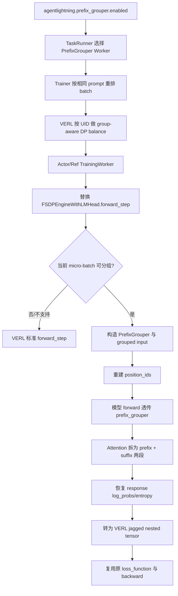

# PrefixGrouper 接入 Agent Lightning：接入点与调用链

> 讲解口径基于仓库 `parallel` 分支、提交 `c337480`（2026-08-25）。当前主链路是 Agent Lightning + VERL 0.9.x + PrefixGrouper 0.0.1.post1。

## 1. 一句话说明

Agent Lightning 没有改变 GRPO 的奖励、优势或损失公式，而是在 VERL 的 actor/reference 模型前向入口处插入 PrefixGrouper：同一个 prompt 对应的多条 response 共用一次 prompt 前向，再把结果恢复成 VERL 原有的逐样本输出格式。因此上层 PPO/GRPO 逻辑不需要感知底层输入被重新组织过。

优化覆盖：

- old-policy log-prob 前向；
- reference-policy log-prob 前向；
- actor update 的前向与反向。

不覆盖：

- vLLM rollout 生成；
- reward、advantage、KL 等算法计算；
- critic 和 reward-model worker；
- 没有重复 prompt 的 micro-batch。

## 2. 为什么需要 PrefixGrouper

设一个 prompt 长度为 `P`，它有 `G` 条 response，每条长度为 `S`。

普通 GRPO 输入：

```text
[P, S1]
[P, S2]
...
[P, SG]
```

PrefixGrouper 的物理输入：

```text
[P, S1, S2, ..., SG]
```

这些 suffix 虽然在物理张量中串联，但逻辑上彼此独立。每层 Attention 被拆成：

1. prompt 自注意力，只计算一次；
2. 每条 response 分别关注共享 prompt 和自己的历史 token；
3. 将结果重新拼回 grouped 布局，继续通过后续层。

位置编码会让每条 response 都从 `P` 位置重新开始，attention mask 则阻止 response 之间互相看到。

在等长示例中，dense model token 数由：

```text
baseline = G × (P + S)
grouped  = P + G × S
```

Attention 因共享 prompt 理论上减少的 causal pair 数为：

```text
(G - 1) × P × (P + 1) / 2
```

这是理论工作量变化，不等同于实际加速比；实际收益还受分组命中率、padding、micro-batch 边界、模型规模和设备算子影响。

## 3. 总体调用链



## 4. 接入点总览

| 层级 | 接入位置 | 作用 | 关闭开关后的行为 |
|---|---|---|---|
| 依赖 | `agent-lightning/pyproject.toml:36-40` | 在 `verl` optional dependency 中加入 `prefix_grouper` | 不导入运行时模块 |
| 配置 | `agent-lightning/agentlightning/verl/config.yaml:15-16` | 提供总开关，默认关闭 | 使用 Agent Lightning 原路径 |
| DP 保组 | `config.yaml:27-30` | 把开关映射到 VERL 的 `actor.use_prefix_grouper` | 使用普通序列长度均衡 |
| Worker 路由 | `entrypoint.py:166-176` | 将标准 `ActorRolloutRefWorker` 换成 PrefixGrouper 版本 | 标准 VERL Worker |
| Batch 重排 | `trainer.py:251-254, 362-365` | 让相同 prompt 在切分前相邻 | 保留原随机 shuffle |
| FSDP Engine Hook | `prefix_grouper.py:390-478` | 给 actor/ref 的 FSDP engine 替换 `forward_step` | 不创建自定义 Worker |
| 数据组织 | `prefix_grouper.py:291-387` | 找组、拼输入、建位置、恢复输出 | 无重复项时自动回退 |
| Attention Patch | `prefix_grouper.py:56-195` | 把 Attention 接到 PrefixGrouper，并分派 CUDA/NPU 算子 | 无 `prefix_grouper` 参数时调用原 Attention |
| 验证与评测 | `tests/verl/`、`prefix_grouper_benchmark.py`、`scripts/benchmark_prefix_grouper.py` | 检查数值/梯度、设备接口和 PPA | 不影响训练主链路 |

下面按运行顺序展开。

## 5. 接入点一：依赖和配置开关

### 5.1 依赖声明

`agent-lightning/pyproject.toml` 的 `verl` extra 增加：

```toml
prefix_grouper>=0.0.1.post1
```

用于 GPU/NPU 独立环境的脚本则固定使用 `prefix_grouper==0.0.1.post1`：

- `scripts/requirements_prefix_grouper_gpu.txt`
- `scripts/requirements_prefix_grouper_npu.txt`
- `scripts/prefix_grouper_stack.py`

### 5.2 功能开关

`agentlightning/verl/config.yaml`：

```yaml
agentlightning:
  prefix_grouper:
    enabled: false

actor_rollout_ref:
  actor:
    use_prefix_grouper: ${agentlightning.prefix_grouper.enabled}
```

两个配置字段职责不同：

- `agentlightning.prefix_grouper.enabled`：Agent Lightning 的总开关，控制 Worker 替换和 batch 重排；
- `actor.use_prefix_grouper`：通知 VERL 的 `_balance_batch` 使用按 UID 分组的 DP 均衡，防止同一组被拆到不同 data-parallel rank。

典型启用方式：

```python
algorithm = agl.VERL(
    config={
        "agentlightning": {"prefix_grouper": {"enabled": True}},
        "algorithm": {"adv_estimator": "grpo"},
        "actor_rollout_ref": {
            "model": {
                "path": "Qwen/Qwen2.5-0.5B-Instruct",
                "use_remove_padding": False,
            },
            "rollout": {
                "n": 4,
                "log_prob_micro_batch_size_per_gpu": 4,
            },
            "actor": {"ppo_micro_batch_size_per_gpu": 4},
            "ref": {"log_prob_micro_batch_size_per_gpu": 4},
        },
    }
)
```

micro-batch size 最好是 `rollout.n` 的整数倍，否则一个 prompt 的 response 组可能跨 micro-batch，能共享的前缀随之减少。

这里的 `use_remove_padding=false` 容易被误解：它要求 VERL 保留可供分组的 padded `prompts` 和 `responses`，并不表示 loss 侧放弃 jagged layout。当前适配最终仍把 log-prob/entropy 恢复为与 `input_ids` 对齐的 nested tensor。

## 6. 接入点二：Ray Worker 路由

入口位于 `agentlightning/verl/entrypoint.py:166-176`。

开关打开后，`TaskRunner` 不再注册 VERL 原生 `ActorRolloutRefWorker`，而是注册：

```text
PrefixGrouperActorRolloutRefWorker
├── actor_worker_cls = PrefixGrouperTrainingWorker
└── ref_worker_cls   = PrefixGrouperTrainingWorker
```

这一步决定了优化范围：actor 和 reference 的训练型前向都进入共享前缀路径，而 rollout 仍由配置的异步 vLLM server 完成。

入口处先做两个快速校验：

- actor strategy 必须为 `fsdp` 或 `fsdp2`；
- `actor_rollout_ref.model.use_remove_padding` 必须为 `false`。

更完整的约束在 Worker 初始化时再次校验，避免 Ray 子进程启动后才以不明确的错误失败。

## 7. 接入点三：Batch 重排与跨 DP 保组

### 7.1 为什么需要重排

PrefixGrouper 最终是在单个 micro-batch 内查找重复 prompt。如果同组 response 在全局 batch 中相距很远，经过 DP 切分和 micro-batch 切分后可能不再相遇，因此即使数据语义上有组，也无法复用。

`reorder_by_prompt()` 使用去掉 padding 后的完整 prompt token ID tuple 作为 key：

```text
key = tuple(prompt[attention_mask].tolist())
```

它只合并 token 完全一致的 prompt，不依赖文本字符串，也不会把“语义相似”误认为相同。分组后按组大小降序排列，使大组优先保持完整。

### 7.2 为什么调用两次

`agentlightning/verl/trainer.py` 中有两个重排点：

1. rollout 数据汇总后、计算 old/ref log-prob 前：让 old-policy 和 reference-policy 前向获得共享机会；
2. 过滤超长样本后、裁剪 PPO mini-batch 前：过滤可能破坏原分组，第二次重排保证 actor update 前重新聚拢。

关闭 PrefixGrouper 时，第二处继续执行原有的随机 shuffle。

### 7.3 DP balance 如何避免拆组

Agent Lightning 将 `data_id_list` 写入 `uid`。VERL 0.9 的 group-aware `_balance_batch` 读取 `actor.use_prefix_grouper`，按 UID 把整组分配到同一个 DP rank，并跳过 rank 内会再次打散组的排序。

这里有两个不同的“相同”判定：

- Agent Lightning 重排和实际 forward：按非 padding prompt token 精确匹配；
- VERL DP balance：按 `uid` 保组。

因此数据层必须保证同一 rollout group 的 `data_id_list/uid` 一致，并且它们对应相同 prompt。若 `trainer.balance_batch=true`，VERL 还要求 UID group 数可以被 DP size 整除。

## 8. 接入点四：TrainingWorker 与 FSDP Engine Hook

核心适配文件是 `agentlightning/verl/prefix_grouper.py`。

`PrefixGrouperTrainingWorker.__init__()` 做三件事：

1. 校验 VERL 和 engine 能力边界；
2. 全局安装 Attention Patch；
3. 在实例级别将 `FSDPEngineWithLMHead.forward_step` 替换为 `_prefix_grouper_forward_step`。

使用 `MethodType` 替换 engine 实例方法，避免修改 VERL 源码，同时保留 VERL `forward_backward_batch`、FSDP 梯度同步、optimizer 和 loss contract。

自定义 `forward_step` 仍遵守 VERL 返回协议：

```text
(loss, {
    "model_output": {"log_probs": ..., "entropy": ...},
    "loss": detached_scalar,
    "metrics": ...,
})
```

因此上层 actor loss、反向和指标聚合无需修改。

## 9. 接入点五：Micro-batch 的 grouped forward

`forward_with_prefix_grouper()` 是数据面的主函数，过程如下。

### 9.1 精确识别重复 prompt

从 `attention_mask` 取 prompt 区域，忽略 padding 后建立稳定分组。若每组大小都为 1，返回 `None`，由 engine hook 调回 VERL 原生 `forward_step`。

### 9.2 抽取一份 prefix 和全部 suffix

每组选第一行作为 prefix representative，全部 response 按组顺序排列，同时记录 `inverse_order`，用于输出恢复到原 batch 顺序。

### 9.3 构建 PrefixGrouper 元数据

`build_prefix_grouper()` 先在 CPU 上调用：

```python
PrefixGrouper.from_ungrouped_masks(
    prefix_mask=...,
    suffix_mask=...,
    group_sizes=...,
    padding_mode="right",
)
```

PrefixGrouper 在这里预计算 prefix/suffix 长度、padding mask、attention mask、group/ungroup 索引和目标 shape。先在 CPU 计算可以避免其预计算过程中的 `.item()` 等数据相关标量操作落在加速器上；随后每个缓存 tensor 只搬到目标设备一次，并保留共享引用。

### 9.4 拼输入与重建 position IDs

`concat_input()` 把每组组织成“一份 prefix + 多份 suffix”。随后复用 VERL 0.9 的 `build_position_ids_for_prefix_grouper()`，让每条 suffix 的 position ID 都从对应 prefix 长度重新开始。

### 9.5 计算 response log-prob

复用 VERL 的 `pg_forward()`：

1. 调用模型，并通过额外参数 `prefix_grouper=...` 进入 Attention Patch；
2. `split_output(..., include_prefix_last=1)` 将 grouped logits 拆回逐 response 布局；
3. prefix 的最后一个位置负责预测 response 的第一个 token，所以它被复制到每个 suffix 开头；
4. 对齐 completion token 后计算 log-prob，按需计算 entropy。

外层再执行 suffix padding 清零、`inverse_order` 还原，以及 VERL jagged nested tensor 格式恢复。最终 loss 看到的 token 位置和标准路径一致。

## 10. 接入点六：模型 Attention Patch

### 10.1 Patch 的两层结构

`apply_prefix_grouper_patch()` 先调用 VERL 0.9 自带的 `apply_prefix_grouper_patch()`，使 Transformers 的 Attention 函数能够接收 `prefix_grouper` 参数；然后覆盖 `ALL_ATTENTION_FUNCTIONS["sdpa"]`，加入当前仓库的 GPU/NPU 设备实现。

Wrapper 的关键分支是：

```text
没有 prefix_grouper -> 原 Attention
存在 prefix_grouper -> PrefixGrouper.forward(attention_forward, Q, K, V)
```

因此 Patch 安装是全局的，但只有 grouped model call 才改变行为。

### 10.2 PrefixGrouper 在每一层做什么

`PrefixGrouper.forward()` 内部执行：

```text
grouped Q/K/V
  ├─ ungroup -> prefix Q/K/V
  └─ ungroup -> suffix Q/K/V

prefix attention: Qp × Kp/Vp
suffix attention: Qs × [repeat(Kp), Ks] / [repeat(Vp), Vs]

两段 output -> group -> 下一层 grouped hidden states
```

`GroupFunction` 和 `UngroupFunction` 都实现了 autograd backward，所以共享 prefix 的梯度会沿 grouped 计算图回传，而不是在集成层手工拼梯度。

### 10.3 CUDA 路径

当前 SDPA wrapper：

- 将 PrefixGrouper 的二维 padding mask 展开为 `[B, 1, Q, K]` causal boolean mask；
- GQA/MQA 模型会通过 `repeat_interleave` 将 KV heads 扩展到 query heads；
- 调用 `torch.nn.functional.scaled_dot_product_attention()`；
- 输出从 `[B, H, S, D]` 转为 Transformers 期望的 `[B, S, H, D]`。

### 10.4 Ascend NPU 路径

当前实现要求 `torch-npu==2.10.0`，调用：

```text
torch_npu.npu_fusion_attention(
    input_layout="BNSD",
    atten_mask=[B, 1, Q, K],
    sparse_mode=0,
)
```

PyTorch SDPA 中 mask 的 `True` 表示“允许”，NPU fused attention 中 `True` 表示“屏蔽”，因此仅在算子边界取反。NPU 路径同样会先展开 KV heads。

### 10.5 Accelerator-safe 补丁

集成还替换了 `PrefixGrouper.batch_repeat_cat()`，为 `torch.repeat_interleave()` 显式传入 `output_size=suffix.shape[0]`，避免设备为推断数据相关输出 shape 而触发额外同步或不兼容行为。

## 11. 回退与失败边界

### 11.1 启动时直接拒绝

以下是当前硬约束：

- VERL 必须为 `0.9.x`；
- engine 必须为 FSDP/FSDP2；
- 仅 language model worker；
- `use_remove_padding=false`；
- fused kernels 关闭；
- `ulysses_sequence_parallel_size=1`。

### 11.2 单个 micro-batch 自动回退

以下情况调用 VERL 标准 `FSDPEngineWithLMHead.forward_step`：

- 包含 `multi_modal_inputs`；
- 动态启用了 remove-padding；
- 动态启用了 fused kernels；
- `distillation_use_topk=true`；
- `calculate_sum_pi_squared=true`；
- 当前 micro-batch 中没有重复 prompt。

### 11.3 仍会直接报错的输入

- prompt/response 没有保留 padded tensor；
- temperature 不是 scalar；
- prompt 为空；
- VERL nested `input_ids` 长度不等于 prompt 长度加 response 长度；
- NPU 的 Q/K/V 或 mask shape 不符合 BNSD 路径要求。

## 12. 工程验证接入点

### 12.1 正确性测试

`tests/verl/test_prefix_grouper_verl090.py` 覆盖：

- 自定义 actor/ref Worker 是否都使用 `PrefixGrouperTrainingWorker`；
- prompt 分组是否忽略 padding；
- Tiny Qwen2 的 response log-prob、entropy 和所有参数梯度是否与 baseline 接近；
- NPU 是否使用 BNSD、完整四维 mask、正确 dropout/scale；
- 非 2.10.0 的 torch-npu 是否被拒绝。

### 12.2 Benchmark 路径

- `agentlightning/verl/prefix_grouper_benchmark.py`：建立 VERL Ray/FSDP worker，对 baseline 与 grouped 路径进行前向/反向、正确性、延迟、吞吐、显存和功耗测量；
- `scripts/benchmark_prefix_grouper.py`：命令行编排与 JSON/Markdown 报告；
- `tests/verl/test_prefix_grouper_benchmark.py`：工作量公式、功耗解析和统计指标；
- `tests/verl/test_accelerator_compatibility.py`：GPU/NPU 选择、版本矩阵和安装计划。

Benchmark 的 baseline 是同一 Agent Lightning/VERL revision、未启用 PrefixGrouper 的标准路径。讲性能时应引用同条件实测数据，不应把第 2 节理论 token/pair 降幅直接称为速度提升。

## 13. 当前仓库需要特别说明的两处口径差异

### 13.1 NPU 文档已落后于代码

`docs/algorithm-zoo/verl.md:70` 仍描述为：TND packed tensor、压缩 causal mask、原生 GQA、不展开 KV heads、不物化 `[B, 1, Q, K]` mask。

但当前 `prefix_grouper.py:56-163` 和对应测试实际是：

- `input_layout="BNSD"`；
- 使用完整 `[B, 1, Q, K]` boolean mask；
- `sparse_mode=0`；
- GQA KV heads 先通过 `repeat_interleave` 展开。

讲解当前实现时应以代码与测试为准；现有 `verl.md` 这一句需要后续同步更新。

### 13.2 optional dependency 范围比运行时约束更宽

`pyproject.toml` 声明 `verl>=0.5.0`，但 `_check_verl_version()` 明确只接受 `0.9.x`。GPU/NPU 专用 requirements 已固定 `verl==0.9.0`，实际部署应采用固定矩阵，不能只依赖宽泛的 optional extra。

## 14. 讲解时可用的四层总结

1. **数据层**：把同 prompt 的 response 聚在同一 batch/rank/micro-batch。
2. **执行层**：用自定义 actor/ref Worker 把 FSDP `forward_step` 切到 grouped forward。
3. **模型层**：Attention 将共享 prefix 和独立 suffix 分开计算，再拼回原模型层间布局。
4. **契约层**：把结果恢复为 VERL 原有 jagged nested tensor，继续复用原 loss、backward 和 PPO/GRPO 流程。

这套接入的关键不是只调用一次 `PrefixGrouper.concat_input()`，而是同时打通“保组、位置编码、Attention mask、输出恢复、FSDP loss contract”五个环节；少一个环节都可能只是减少了输入重复，却无法保证训练语义或实际复用成立。

## 15. 关键源码索引

- [`agent-lightning/agentlightning/verl/config.yaml`](agent-lightning/agentlightning/verl/config.yaml)
- [`agent-lightning/agentlightning/verl/entrypoint.py`](agent-lightning/agentlightning/verl/entrypoint.py)
- [`agent-lightning/agentlightning/verl/trainer.py`](agent-lightning/agentlightning/verl/trainer.py)
- [`agent-lightning/agentlightning/verl/prefix_grouper.py`](agent-lightning/agentlightning/verl/prefix_grouper.py)
- [`agent-lightning/agentlightning/verl/prefix_grouper_benchmark.py`](agent-lightning/agentlightning/verl/prefix_grouper_benchmark.py)
- [`agent-lightning/scripts/benchmark_prefix_grouper.py`](agent-lightning/scripts/benchmark_prefix_grouper.py)
- [`agent-lightning/scripts/prefix_grouper_stack.py`](agent-lightning/scripts/prefix_grouper_stack.py)
- [`agent-lightning/tests/verl/test_prefix_grouper_verl090.py`](agent-lightning/tests/verl/test_prefix_grouper_verl090.py)
- [`PrefixGrouper/src/prefix_grouper/__init__.py`](PrefixGrouper/src/prefix_grouper/__init__.py)
- [`PrefixGrouper/src/prefix_grouper/forward.py`](PrefixGrouper/src/prefix_grouper/forward.py)
- [`PrefixGrouper/src/prefix_grouper/function.py`](PrefixGrouper/src/prefix_grouper/function.py)
